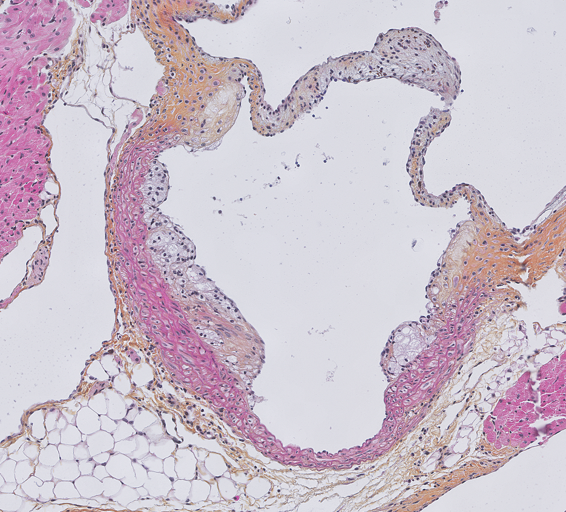
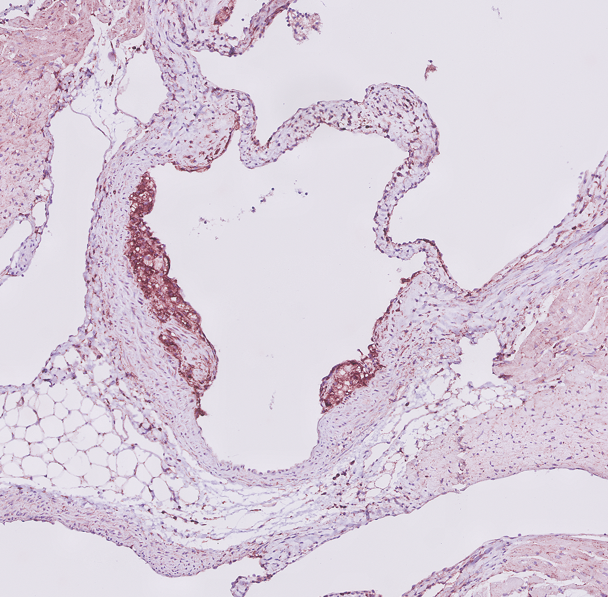
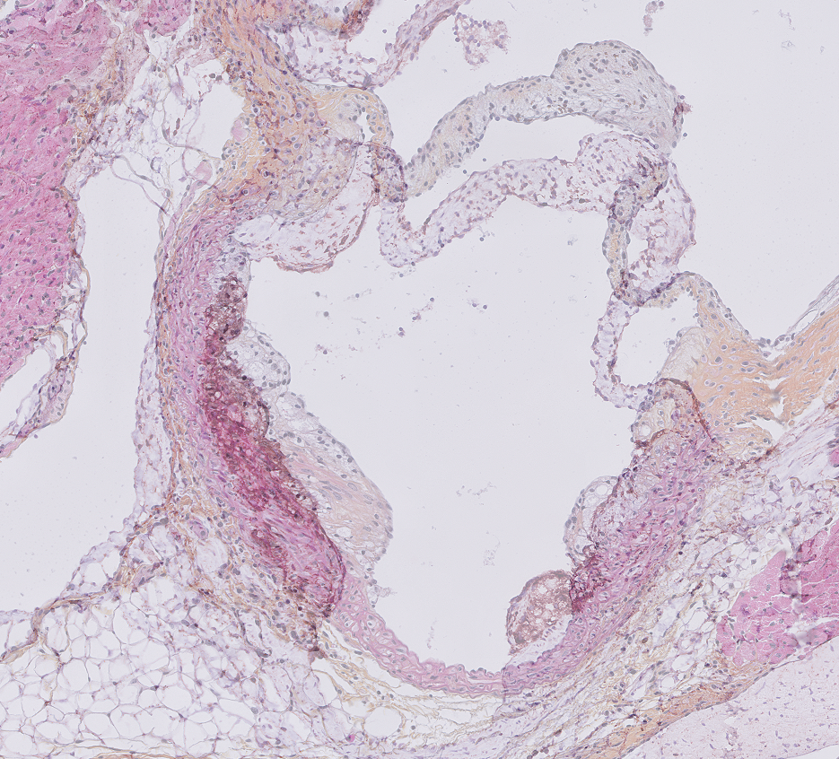
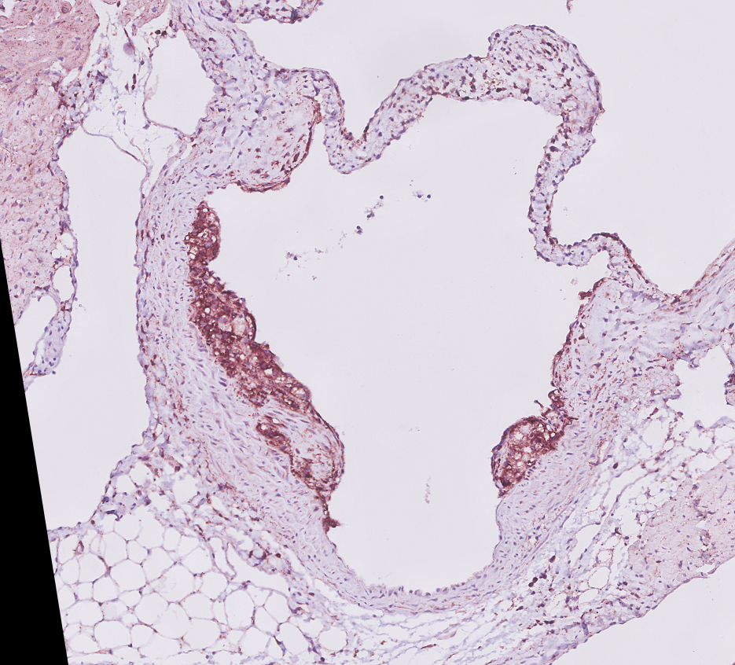
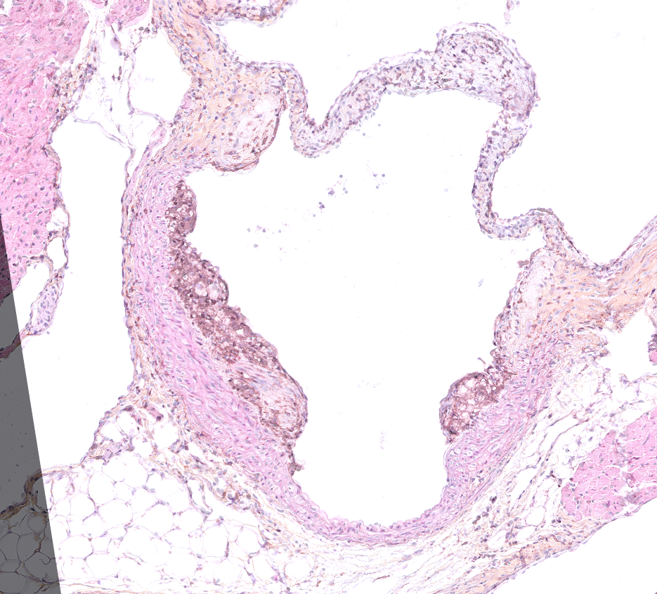
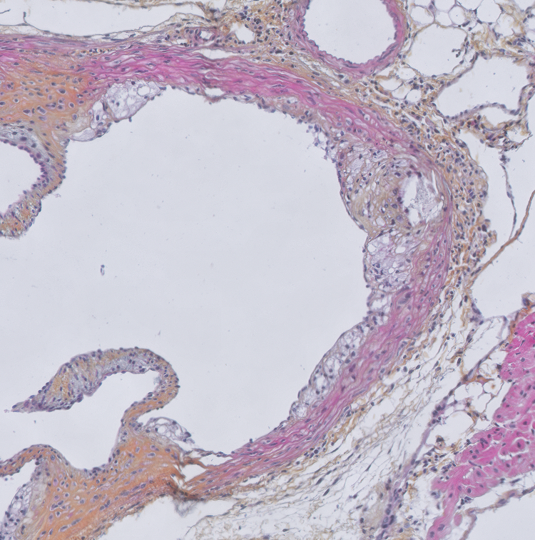
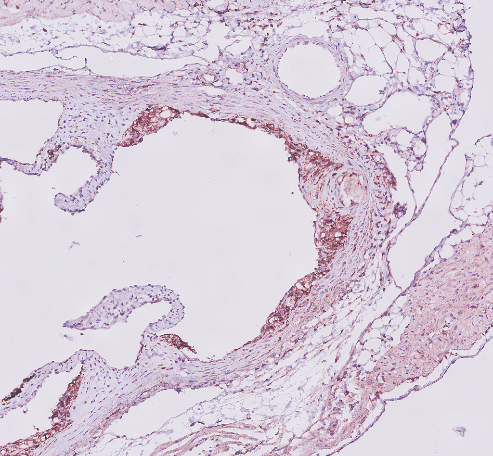
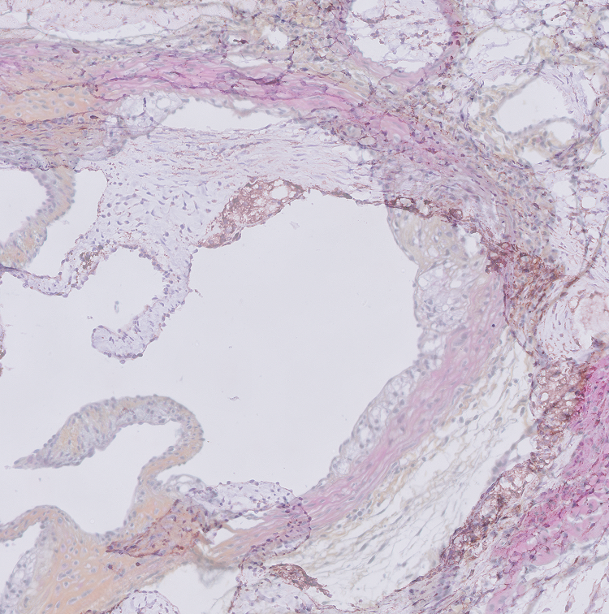
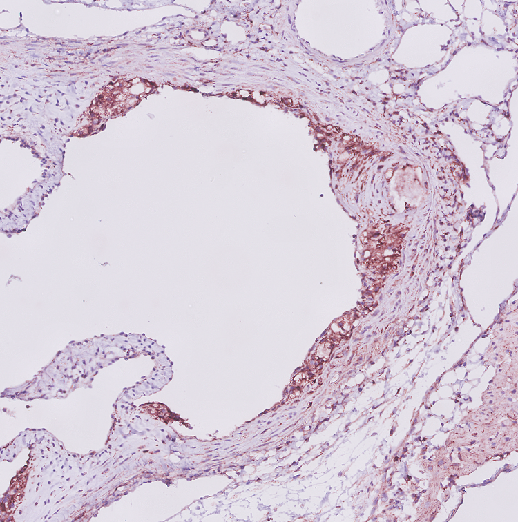
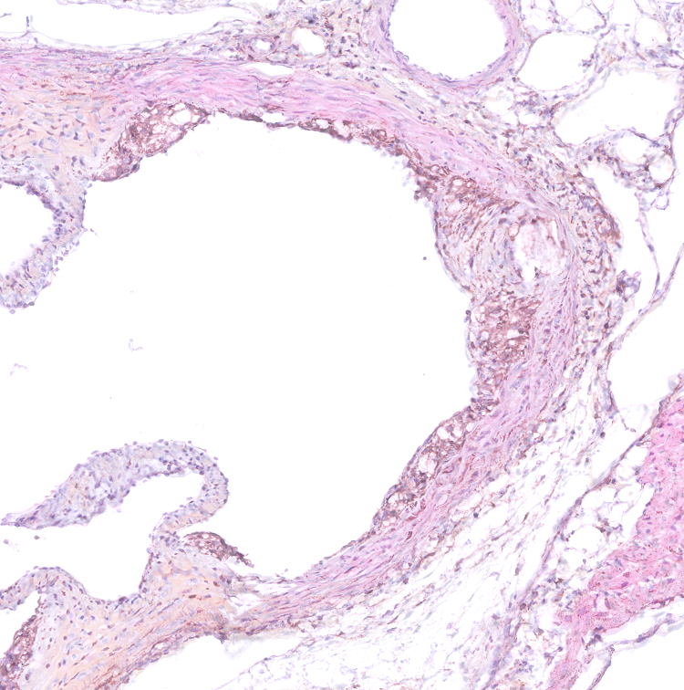

# Cross-section aligner
This script has been developed to align images. It has been optimized for consecutive histological cross-sections of the aortic root area of murine hearts, but can be used for other purposes as well.

If you choose to use this code please cite:
van der Vaart JI, van Eenige R, Rensen PCN, Kooijman S. Atherosclerosis: an overview of mouse models and detailed methodology to quantify atherosclerotic lesions in the aortic root. (2023)

## Getting started
These instructions will get you the script up and running on your local machine.

### Dependencies
This script uses Python3 with the packages NumPy and opencv-python. The script has been tested with:
- Python >= 3.9.0
- NumPy >= 1.21.0
- opencv-python >= 4.5.0.00

To install the required dependencies, you can use pip3 with the following command:
```shell
pip3 install opencv-python
pip3 install numpy
```

### Usage
```
python3 alignCrossSections.py -r <reference directory> -t <target directory> -x <threshold reference images> -y <threshold target images> [-s <treshold change steps>] [-m <treshold max change>] [-b <scale factor boundaries>] [-o <output-directory>] [-l <logfile-directory>] [-p] [-h]

Options:
  -h, --help                                   Show this help message and exit
  -r, --reference-directory=DIR                Set the directory for reference images (required)
  -t, --target-directory=DIR                   Set the directory for target images (required)
  -x, --threshold-reference-images=THRESHOLD   Set the threshold for reference images (required, 0-255)
  -y, --threshold-target-images=THRESHOLD      Set the threshold for target images (required, 0-255)
  -s, --treshold-change-steps=STEPS            Set the threshold change steps (optional, default: 2)
  -m, --treshold-max-change=MAX                Set the threshold max change (optional, default: 20)
  -b, --scale-factor-boundaries=MIN,MAX        Set the scale factor boundaries (optional, default: 0.95,1.05)
  -o, --output-directory=DIR                   Set the output directory (optional, default: ./Alignments/'target-directory-basename'_Alignments/)
  -l, --logfile-directory=DIR                  Set the logfile path (optional, default: ./)
  -p, --suppress-overlap-images                Supress the creation of overlap images
```

## User guide
This script has been developed to align images. It has been optimized for consecutive histological cross-sections of the aortic root area of murine hearts, but can be used for other purposes as well.

The script will attempt to align 'target images' to 'reference images'. Corresponding reference and target images should have identical names. The script requires all reference images to be located within one folder (specified with ```-r, <reference-directory>```), and all target images within another folder (specified with ```-t, <target-directory>```).

For each pair of target and reference images, both images will be loaded, converted to grayscale, and subsequently converted to black and white using tresholds to be provided with ```-x, <threshold-reference-images>``` for reference images, and ```-y, <threshold target images>``` for target images. Thresholds can range from 0-255, and, assuming the images are histological cross-sections, should be chosen in such way that the tissue sample can be well distinguished from the background. Next, the target image will be aligned with the reference image. For this, a rigid transformation matrix is calculated, and the target image is transformed, scaled and rotated. In other words, the target image can move both horizontally and vertically, scale and rotate. The scale factor, and rotation angle will be noted. For consecutive histological cross-sections, it does not make sense to scale an image beyond certain biologically plausible boundaries. Therefore, by default, scaling is limited to -5% and +5%. Optionally, alternative boundaries can be specified with ```-b, <scale-factor-boundaries>```.

After alignment, in case the acquired scale factor falls outside the defined boundaries, the software assumes alignment was unsuccessful. It will then retry the alignment with different image thresholds. Specifically, the target and reference image treshold, respectively, will be increased and decreased, in that order, until a threshold combination yields a successful alignment, that is, the scale factor does fall within the defined boundaries. By default, the image thresholds change with steps of 2, with a maximum increase and decrease of 20. An alternative step size, and an alternative maximum change can be optionally be specified with ```-s, <treshold-change-steps>``` and ```-m, <treshold-max-change>```, respectively. In case no treshold combination yields a successful alignment, alignment will stop for that target image.

By default, a subfolder is created within the current working directory, which serves as the output directory. An alternative output directory can be specified with ```-o, <output-directory>```. After successful alignment, transformed target images are written to the output directory. By default, an extra subfolder named 'overlap' will be created within the output directory. To this folder, images will be written in which the transformed target image is overlayed with the reference image with opacity set at 50%. These 'overlap' images allow users to conveniently manually check the alignment of each image. Creation of this extra subfolder, and creation of these 'overlap' images can be suppressed with ```-p, <suppress-overlap-images>```.

For each image, the tresholds that were ultimately used for alignment, as well as the scale factor and rotation angle, are written to a log file. By default, this log file will be created within the current working directory, but an alternative location can be specified with ```-l, <logfile-directory>```.

## Examples
Below, two reference image and two corresponding target images, as well as their overlap before alignment, are shown. Next, the target images were aligned with the corresponding reference image with ```-x 200``` and ```-y 220```; the aligned target images, as well as their overlap with the reference images, are also shown.

||Reference image|Target image|Overlap *before* alignment|Aligned target image|Overlap *aligned* target image<br>with reference image|Details|
|---|---|---|--- |---|---|---|
|**Example 1**||||||Treshold reference image: 200<br>Treshold aligned image: 220<br>Rotation angle: -9.082562368378547<br>Scale factor: 1.0119630547842335|
|**Example 2**||||||Treshold reference image: 200<br>Treshold aligned image: 224<br>Rotation angle: -1.850680346593716<br>Scale factor: 0.9941927700502378|

## License
This program is free software: you can redistribute it and/or modify it under the terms of the GNU General Public License as published by the Free Software Foundation, either version 3 of the License, or (at your option) any later version - see the [LICENSE](./LICENSE) file for details.